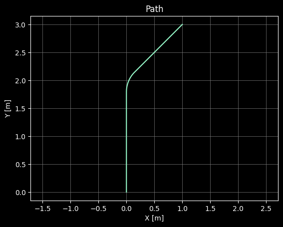
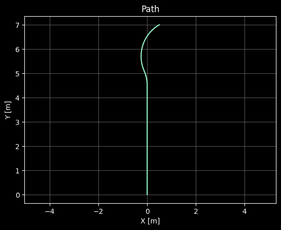
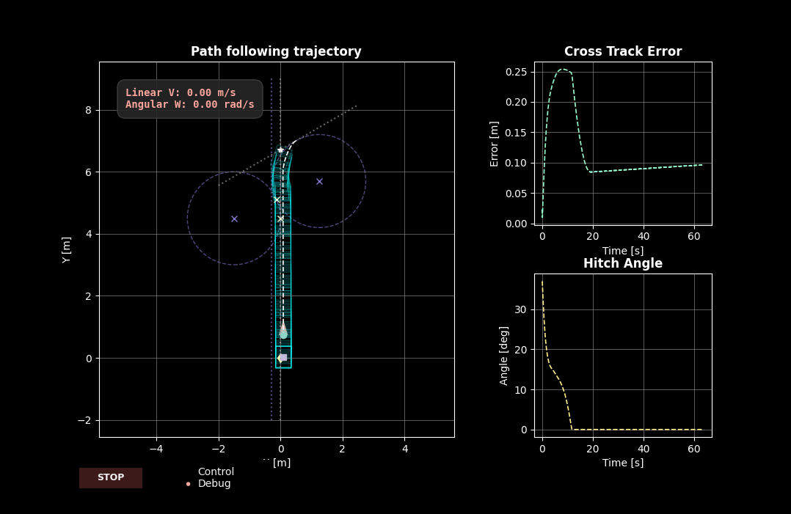

# Reverse Manoeuvre Algorithm

This project provides an automated control solution for a differential-drive robot tasked with parking a cart in space-constrained environments where forward movement is not possible.

This repository includes a Python simulation with an advanced control approach and a ROS node implementation in C++. Both implementations share one core component:

### Geometry Solver
The Geometry Solver calculates a feasible trajectory based on the robot's initial pose and the target docking location. In standard scenarios, the solver constructs a path consisting of an initial straight line, a single circular turning arc, and a final straight-line approach to the target. When the robot's initial pose has already passed the entry point of the primary turning circle, the solver implements overshoot logic that calculates a second tangent circle to compensate for the robot's position and redirect it back toward proper target alignment.

| Standard Case | Overshoot Case |
| :--- | :--- |
| | |

The resulting geometry is converted into a discrete set of coordinates $(x,y)$ that serve as reference points for the controller.


## Simulation

The Python simulation environment provides a real-time, interactive interface for testing and validating the reverse manoeuvre algorithm before real-world deployment. It uses a decoupled architecture that runs high-frequency physics and MPC calculations on a dedicated background thread, ensuring control loop stability independent of UI rendering speed.

<p align="center">
  
  <br>
  <sub><b>Figure 1:</b> Reverse Manoeuvre Plot showing trajectory and telemetry.</sub>
</p>

To run the simulation with a custom configuration: `python main.py --config configs/overshoot.yaml`

### Features
- **Trajectory Tracking**: Real-time visualization of robot and cart paths, including a "ghosting" effect showing historical cart positions.
- **Live Telemetry**: Synchronized plots displaying Cross-Track Error and Hitch Angle for monitoring stability.
- **Debug Overlays**: Visual display of the Geometry Solver's internal logic, including the circles that define the turning arcs.
- **Interactive UI**: Stop button and radio toggles for switching between standard control and debug visualization modes.
- **Configuration Files**: YAML-based configuration system supporting different scenarios (standard path, overshoot cases).

### Controller
The controller implements a kinematic model of the robot-cart system. The robot state is defined as:

$$state = [x_{robot}, y_{robot}, \theta_{heading}, \gamma_{hitch}]$$

The system can be controlled via its linear velocity ($v_x$) and angular velocity ($\omega$). The controller maintains a constant backing velocity $v_x$ and focuses exclusively on optimizing $\omega$.

To account for the nonlinear, unstable dynamics of the system, a **Model Predictive Controller (MPC)** is used to find the optimal control sequence for $\omega$ over a defined prediction horizon. The MPC minimizes a multi-objective cost function:

$$J = \sum_{i=1}^{N} (K_{dist} \cdot e_{cross}^2 + K_{turn} \cdot \omega^2 + K_{hitch} \cdot \frac{|\gamma|}{\gamma_{limit}})$$

This balances three critical objectives:
- **Cross-track error ($e_{cross}$)**: Minimizes the $L_2$ distance between the cart and the reference path.
- **Hitch stability**: Penalizes large hitch angles ($\gamma$) to prevent jackknifing.
- **Steering effort**: Penalizes high angular velocities to prevent aggressive oscillations and ensure smooth mechanical movement.

The gains $K_{dist}$, $K_{turn}$, and $K_{hitch}$, along with other parameters affecting controller performance, are tuned using **Optuna**.


### Parameter Tuning

The controller parameters can be optimized using Optuna:
```bash
cd Simulation/scripts
python tuner.py
```

This runs hyperparameter optimization trials to find the best values for `K_dist`, `K_turn`, `K_hitch`, and `lookahead_distance`, ensuring the robot reaches the target with minimal cross-track error and a final hitch angle close to 0°.

## ROS Implementation

The ROS implementation provides a C++ node for deployment on real robotic systems. When triggered, the node calculates the path based on the robot's current position and the target location.

### Results


In simulation of the real-world environment, it is possible to see that the manoeuvre is successfully executed.


